# 📚 Gravity Book Store — Data Warehouse Project

> An end-to-end Data Warehouse solution built for **Gravity Book Store**, covering data modeling, ETL pipeline development, OLAP cube creation, and interactive Power BI dashboards.

---

## 🗂️ Table of Contents

- [Project Overview](#project-overview)
- [Tech Stack](#tech-stack)
- [1. Data Modeling — Galaxy Schema](#1-data-modeling--galaxy-schema)
- [2. ETL Pipeline — SSIS](#2-etl-pipeline--ssis)
- [3. OLAP Cube — SSAS](#3-olap-cube--ssas)
- [4. Power BI Dashboard](#4-power-bi-dashboard)
- [Key Metrics & Insights](#key-metrics--insights)

---

## Project Overview

This project transforms raw transactional data from the **Gravity Book Store** source database into a fully operational data warehouse. The pipeline covers every stage of the BI lifecycle:

1. **Designing** a Galaxy Schema tailored to the business requirements
2. **Building** an SSIS ETL pipeline to load and transform data into the warehouse
3. **Creating** an SSAS multidimensional cube with business measures
4. **Visualizing** insights through a Power BI dashboard

---

## Tech Stack

| Layer | Tool |
|---|---|
| Source Database | SQL Server (OLTP) |
| Data Modeling | ERD / Galaxy Schema |
| ETL | SQL Server Integration Services (SSIS) |
| OLAP Cube | SQL Server Analysis Services (SSAS) |
| Visualization | Power BI |

---

## 1. Data Modeling — Galaxy Schema

### Why Galaxy Schema?

The Gravity Book Store business has **two fact processes** — Sales Orders and Order History — that share several conformed dimensions. A Galaxy Schema (also known as a Fact Constellation) was the natural choice, as it supports multiple fact tables linked through shared dimension tables, enabling cross-process analytics.

### Many-to-Many Relationships & Bridge Tables

The domain includes inherent many-to-many relationships:
- A **Book** can have multiple **Authors**, and an Author can write multiple Books → resolved via the `Book_Author` bridge table.
- A **Customer** can have multiple **Addresses**, and addresses can be shared → resolved via the `Customer_Address` bridge table.

### Schema Diagram

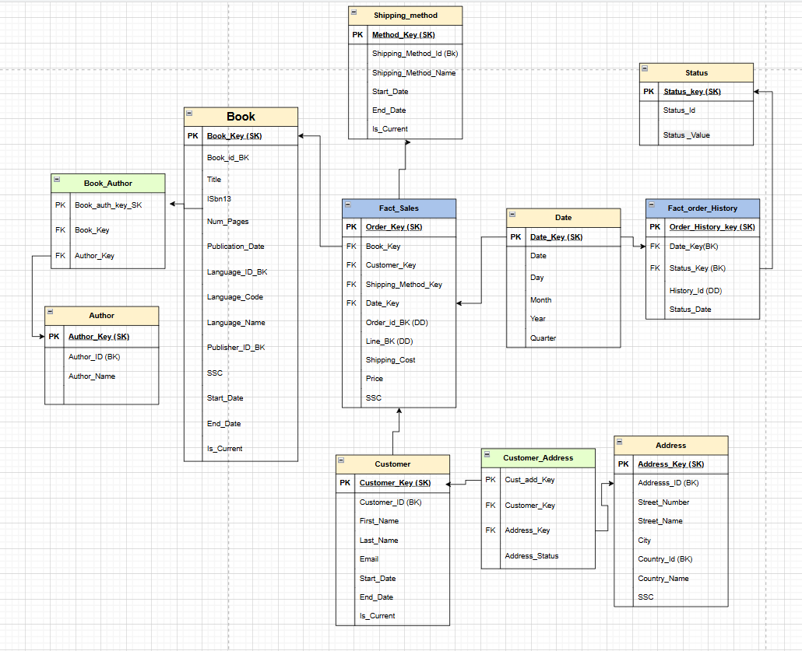

### Data Warehouse Model (SSMS View)

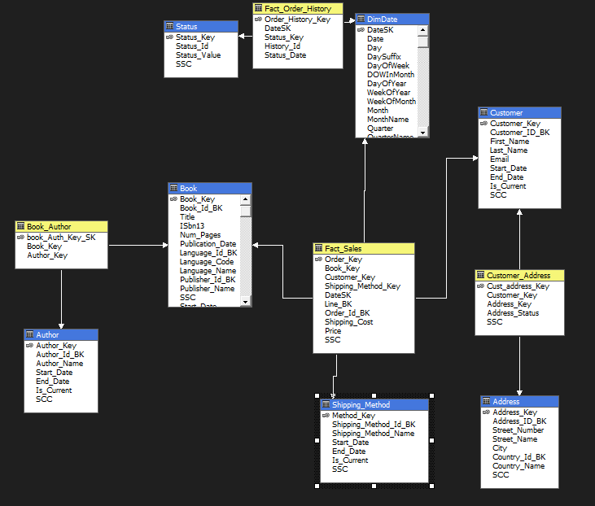

---

### Dimension Tables

All dimensions implement **Slowly Changing Dimensions (SCD)** where applicable, tracking historical changes with `Start_Date`, `End_Date`, `Is_Current`, and a surrogate key (SK).

| Dimension | Description |
|---|---|
| `Book` | Book details including language, publisher, publication date |
| `Author` | Author identity — SCD Type 2 |
| `Customer` | Customer identity — SCD Type 2 |
| `Address` | Physical addresses with country information |
| `Shipping_Method` | Delivery method — SCD Type 2 |
| `Status` | Order status lookup (SCD Type 1) |
| `DimDate` | Standard date dimension with Day, Month, Quarter, Year hierarchies |

#### Address Dimension
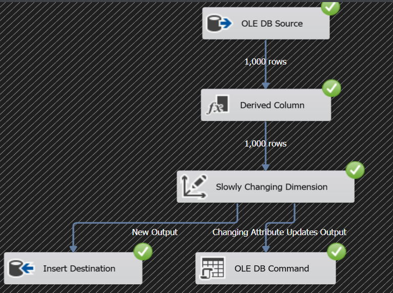

#### Author Dimension
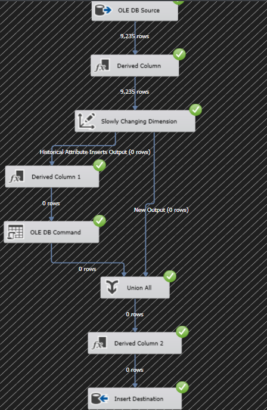

#### Book Dimension
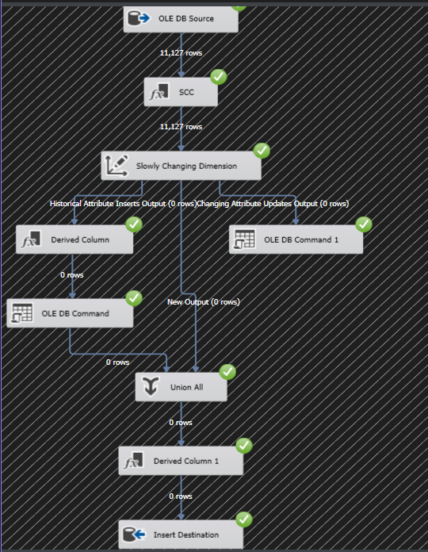

#### Customer Dimension
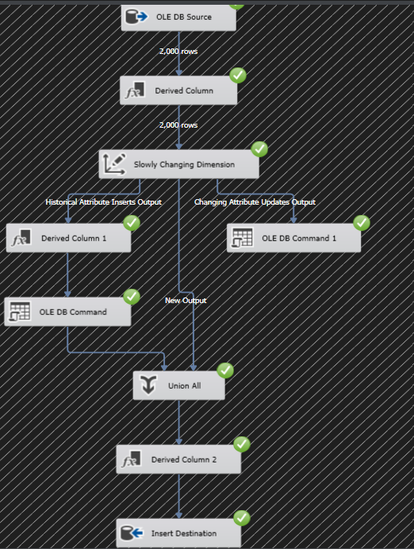

#### Shipping Method Dimension


#### Status Dimension
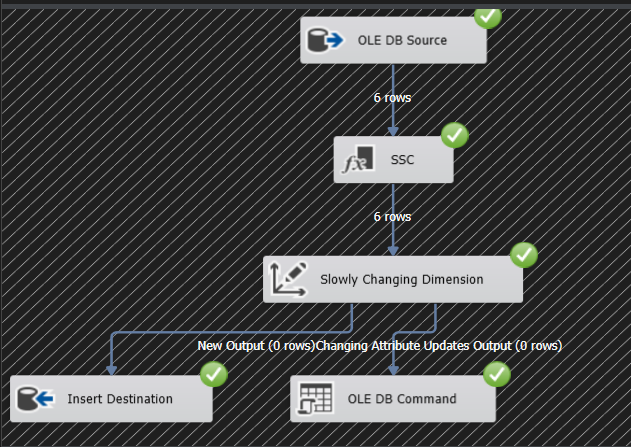

---

### Bridge Tables

#### Book–Author Bridge
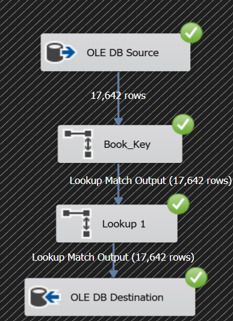

#### Customer–Address Bridge
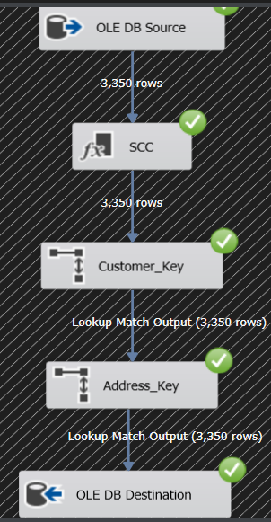

---

### Fact Tables

| Fact Table | Grain | Key Measures |
|---|---|---|
| `Fact_Sales` | One row per order line | Price, Shipping Cost |
| `Fact_Order_History` | One row per order status event | Status tracking over time |

#### Fact Sales
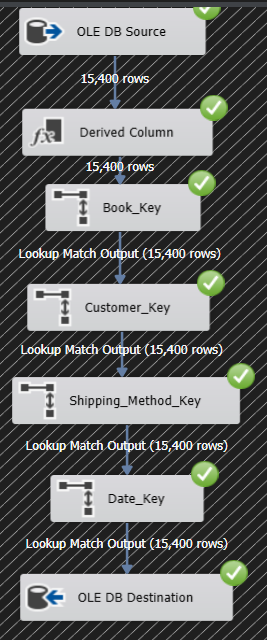

#### Fact Order History
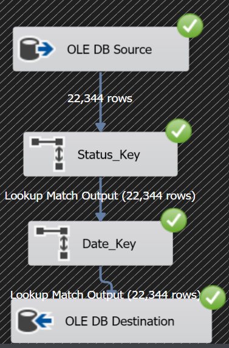

---

## 2. ETL Pipeline — SSIS

The ETL pipeline was built in **SQL Server Integration Services (SSIS)** and is organized into three execution layers managed by a master package.

### Master Execution Flow

The master package orchestrates execution in strict dependency order:

```
Execute_Dims → Execute_Bridges → Execute_Facts
```

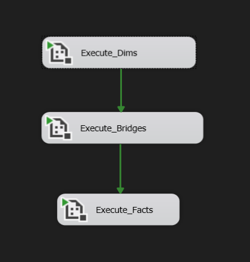

---

### Layer 1 — Dimensions

All six dimension packages run sequentially to ensure referential integrity before any bridge or fact data is loaded.

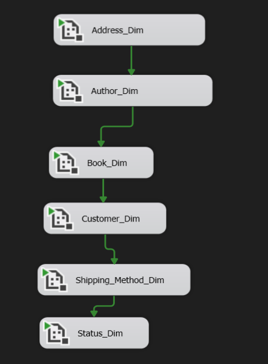

Each dimension package follows a standard SCD pipeline pattern:

- **OLE DB Source** → reads from the staging/source database
- **Derived Column** → computes SCC (Source Change Checksum) hash for change detection
- **Slowly Changing Dimension** → routes rows to:
  - *New Output* → Insert Destination (new records)
  - *Changing Attribute Updates* → OLE DB Command (SCD Type 1 updates)
  - *Historical Attribute Inserts* → Derived Column + OLE DB Command (SCD Type 2 versioning)
- **Union All + Derived Column** → assigns surrogate keys to new historical versions
- **Insert Destination** → loads final records into the DW dimension table

---

### Layer 2 — Bridge Tables

Bridge tables are loaded after all dimensions are ready, performing foreign key lookups to resolve surrogate keys.

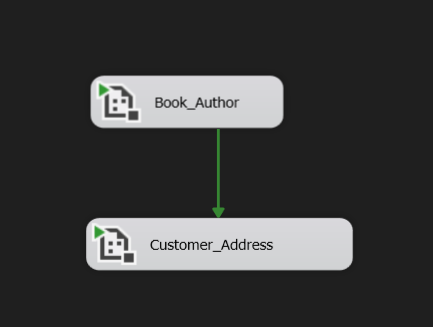

**Book_Author** — Lookup on `Book_Key` and `Author_Key`:


**Customer_Address** — Lookup on `Customer_Key` and `Address_Key`:


---

### Layer 3 — Fact Tables

Facts are loaded last, after all dimension and bridge tables are populated, using multiple sequential lookups to resolve all foreign keys.

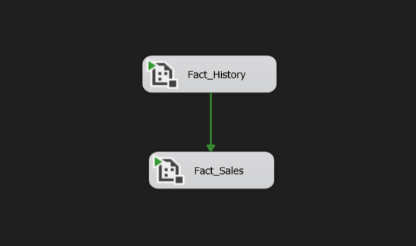

**Fact_Sales** — Resolves `Book_Key`, `Customer_Key`, `Shipping_Method_Key`, and `Date_Key` via chained lookups across 15,400 rows:


**Fact_Order_History** — Resolves `Status_Key` and `Date_Key` across 22,344 rows:


---

## 3. OLAP Cube — SSAS

An **SSAS Multidimensional Cube** was built on top of the data warehouse, defining measures and dimension hierarchies to enable fast, sliceable analytics.

### Cube Structure

The cube exposes the following dimensions to users:
- **Author**, **Book**, **Customer**, **Customer Address**, **Dim Date** (with Day → Month → Year hierarchy), **Shipping Method**

### Calculated Measures

| Measure | Description |
|---|---|
| `Cancellation_Rate` | Ratio of cancelled orders to total orders |
| `Delivery_Rate` | Ratio of delivered orders to total orders |
| `Delivered_Orders` | Count of successfully delivered orders |
| `Cancelled_Orders` | Count of cancelled orders |
| `AVG_order_price` | Average price per order |
| `AVG_spent_per_customer` | Average total spend per customer |

### Cube Browser (MDX Query Result)

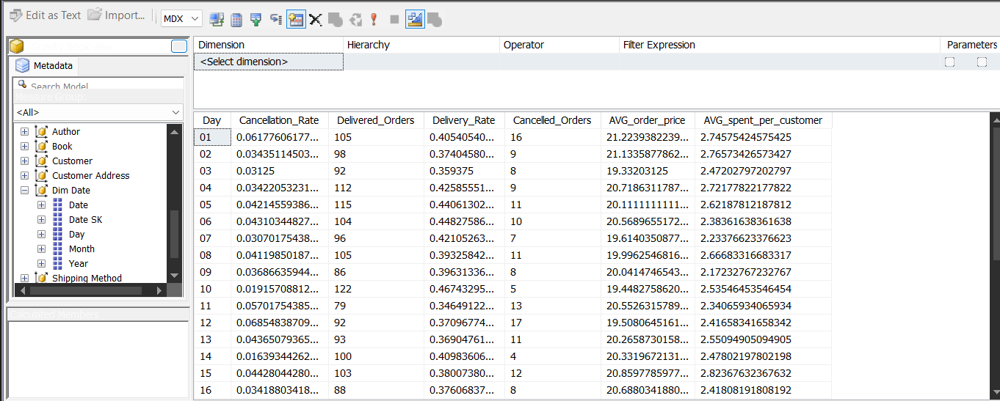

---

## 4. Power BI Dashboard

The Power BI report connects directly to the SSAS cube and provides two interactive dashboard pages, both filterable by year (2020–2024).

### Page 1 — Sales Overview


| KPI | Value |
|---|---|
| Total Revenue | $154.3K |
| Total Orders | 7.5K |
| Total Sold Books | 15.4K |
| Total Customers | 2K |

**Visuals include:**
- Total revenue breakdown by book language (donut chart) — English dominates at 85%
- Top customers by number of orders (lollipop chart)
- Top authors by total revenue (bar chart)
- Total revenue trend over years — 2020–2025 (line chart)

---

### Page 2 — Operations & Analytics


| KPI | Value |
|---|---|
| AVG Order Price | $20.46 |
| AVG Spent per Customer | $77.16 |
| Total Authors | 9.24K |
| Delivery Rate | 39.70% |

**Visuals include:**
- Order status distribution (donut chart) — Order Received leads at 35.43%
- Top books by shipping method (horizontal bar chart) — Express is #1
- Total revenue by quarter and year (grouped bar chart)
- Price contribution by publisher name (bar chart) — Vintage leads

---

## Key Metrics & Insights

- 📦 **Express shipping** is the dominant delivery method chosen by customers
- 📖 **English-language books** account for ~85% of total revenue
- 📉 Revenue peaked in **2022** and declined through 2024
- 🔄 Only ~39.7% of orders reach delivered status — cancellation and in-progress rates warrant further investigation
- 👤 Top customers by order volume differ from top customers by total spend

---

## Project Structure

```
Gravity_BookStore_DWH/
│
├── 📁 Book_Cube/                    # SSAS Multidimensional Cube project files
│   └── (cube definitions, measures, dimensions, hierarchies)
│
├── 📁 Gravity Bookstore SSIS/       # SSIS ETL project source files
│   └── (packages: Master, Dims, Bridges, Facts)
│
├── 📁 Power Bi/                     # Power BI report file
│   └── (dashboard .pbix connected to SSAS cube)
│
├── 📁 SSAS/                         # SSAS result screenshots & documentation
│   └── (cube browser, MDX query results)
│
├── 📁 SSIS/                         # SSIS execution result screenshots
│   └── (package run results, row counts, data flow screenshots)
│
└── 📄 Model_Diagram.png             # Galaxy Schema ERD
```

---
